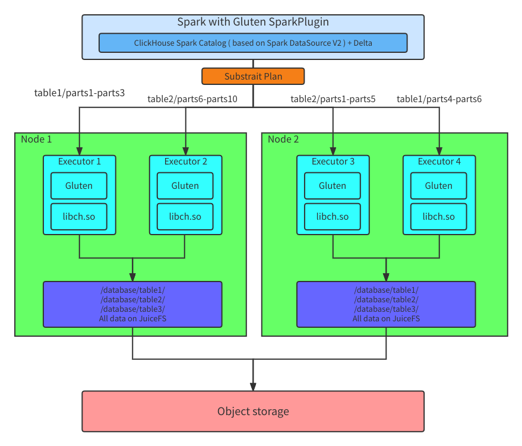
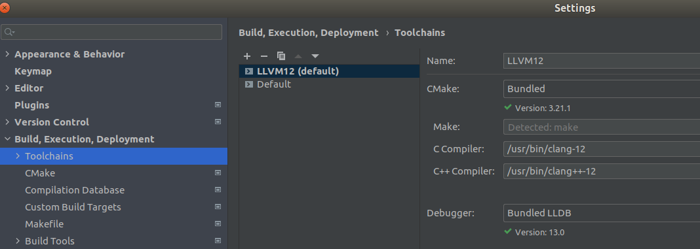
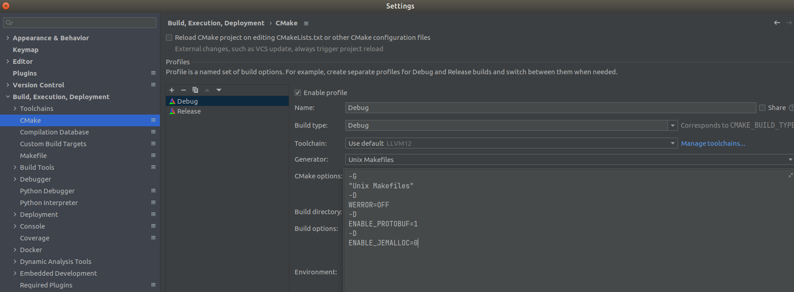
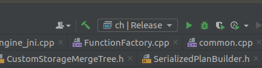
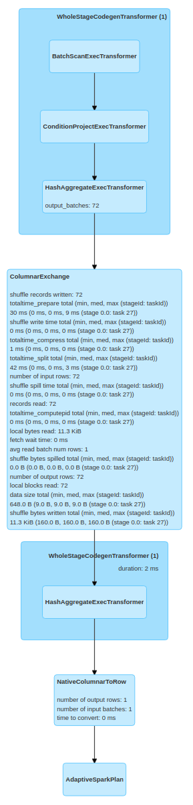

## ClickHouse Backend

ClickHouse is a column-oriented database management system (DBMS) for online analytical processing of queries (OLAP), which supports best in the industry query performance, while significantly reducing storage requirements through its innovative use of columnar storage and compression.
We port ClickHouse ( based on version **21.9.1.1** ) as a library, called 'libch.so', and Gluten loads this library through JNI as the native engine. In this way, we don't need to  deploy a standalone ClickHouse Cluster, Spark uses Gluten as SparkPlugin to read and write ClickHouse MergeTree data.

### Architecture

The architecture of the ClickHouse backend is shown below:



1. On Spark driver, Spark uses Gluten SparkPlugin to transform the physical plan to the Substrait plan, and then pass the Substrait plan to ClickHouse backend through JNI call on executors.
2. Based on Spark DataSource V2 interface, implementing a ClickHouse Catalog to support operating the ClickHouse tables, and then using Delta to save some metadata about ClickHouse like the MergeTree parts information, and also provide ACID transactions.
3. When querying from a ClickHouse table, it will fetch MergeTree parts information from Delta metadata and assign these parts into Spark partitions according to some strategies.
4. On Spark executors, each executor will load the 'libch.so' through JNI when starting, and then call the operators according to the Substrait plan which is passed from Spark Driver, like reading data from the MergeTree parts, writing the MergeTree parts, filtering data, aggregating data and so on.
5. Currently, the ClickHouse backend only supports reading the MergeTree parts from local storage, it needs to use a high-performance shared file system to share a root bucket on every node of the cluster from the object storage, like JuiceFS.


### Development environment setup

In general, we use IDEA for Gluten development and CLion for ClickHouse backend development on **Ubuntu 20**.

#### Prerequisites

- GCC 9.0 or higher version
```
    sudo apt install gcc-9 g++-9 gcc-10 g++-10 gcc-11 g++-11  

    sudo update-alternatives --install /usr/bin/gcc gcc /usr/bin/gcc-11 110 --slave /usr/bin/g++ g++ /usr/bin/g++-11 --slave /usr/bin/gcov gcov /usr/bin/gcov-11
    sudo update-alternatives --install /usr/bin/gcc gcc /usr/bin/gcc-10 100 --slave /usr/bin/g++ g++ /usr/bin/g++-10 --slave /usr/bin/gcov gcov /usr/bin/gcov-10
    sudo update-alternatives --install /usr/bin/gcc gcc /usr/bin/gcc-9 90 --slave /usr/bin/g++ g++ /usr/bin/g++-9 --slave /usr/bin/gcov gcov /usr/bin/gcov-9

    sudo update-alternatives --config gcc  # then choose the right version

```

- Clang 12.0 or higher version ( Please refer to [How-to-Build-ClickHouse-on-Linux](https://clickhouse.com/docs/en/development/build/) )
- cmake 3.20 or higher version ( Please refer to [How-to-Build-ClickHouse-on-Linux](https://clickhouse.com/docs/en/development/build/) )
- Java 8
- Maven 3.6.3 or higher version
- Spark 3.1.1
- Intel Optimized Arrow 7.0.0 ( Please refer to [Intel-Optimized-Arrow-Installation](./ArrowInstallation.md) )


#### Setuping Gluten development environment

- Clone Gluten code
```
    git clone https://github.com/oap-project/gluten
```
- Open Gluten code in IDEA

#### Setuping ClickHouse backend development environment

- Clone ClickHouse backend code
```
    git clone -b local_engine_with_columnar_shuffle https://github.com/liuneng1994/ClickHouse.git
```
- Open ClickHouse backend code in CLion
- Configure the ClickHouse backend project
    - Choose File -> Settings -> Build, Execution, Deployment -> Toolchains, and then choose Bundled CMake, clang-12 as C Compiler, clang++-12 as C++ Compiler:

        

    - Choose File -> Settings -> Build, Execution, Deployment -> CMake:

        

        And then add these options into CMake options:
```
            -G "Unix Makefiles" -D WERROR=OFF -D ENABLE_PROTOBUF=1 -D ENABLE_JEMALLOC=0
```
- Build 'ch' target with Debug mode or Release mode:

    


### Compiling Gluten with ClickHouse backend


### Testing on local


### Benchmark with TPC-H Q6 on Gluten with ClickHouse backend


#### Deploying on Cloud


#### Results


#### Performance


In general, please refer to [Velox Installation](https://github.com/facebookincubator/velox/blob/main/scripts/setup-ubuntu.sh) to install all the dependencies and compile Velox.
In addition to that, there are several points worth attention when compiling Gazelle-Jni with Velox.

Firstly, please note that all the Gazelle-Jni required libraries should be compiled as **position independent code**.
That means, for static libraries, "-fPIC" option should be added in their compiling processes.

Currently, Gazelle-Jni with Velox depends on below libraries:

Required static libraries are:

- fmt
- folly
- iberty

Required shared libraries are:

- glog
- double-conversion
- gtest
- snappy

Gazelle-Jni will try to find above libraries from system lib paths.
If they are not installed there, please copy them to system lib paths,
or change the paths about where to find them specified in [CMakeLists.txt](https://github.com/oap-project/gazelle-jni/blob/velox_dev/cpp/src/CMakeLists.txt).

```shell script
set(SYSTEM_LIB_PATH "/usr/lib" CACHE PATH "System Lib dir")
set(SYSTEM_LIB64_PATH "/usr/lib64" CACHE PATH "System Lib64 dir")
set(SYSTEM_LOCAL_LIB_PATH "/usr/local/lib" CACHE PATH "System Local Lib dir")
set(SYSTEM_LOCAL_LIB64_PATH "/usr/local/lib64" CACHE PATH "System Local Lib64 dir")
```

Secondly, when compiling Velox, please note that Velox generated static libraries should also be compiled as position independent code.
Also, some OBJECT settings in CMakeLists are removed in order to acquire the static libraries.
For these two changes, please refer to this commit [Velox Compiling](https://github.com/rui-mo/velox/commit/ce1dee8f776bc3afa36cd3fc033161fc062cbe98).

Currently, we depends on this Velox commmit: **8d3e951 (Jan 18 2022)**

### An example for Velox computing in Spark based on Gazelle-Jni

TPC-H Q6 is supported in Gazelle-Jni base on Velox computing. Current support still has several limitations: 

- Only Double type is supported.
- Only first stage of TPC-H Q6 (which occupies the most time in this query) is supported.
- Metrics are missing.

#### Test TPC-H Q6 on Gazelle-Jni with Velox computing

##### Data preparation

Considering only Hive LRE V1 is supported in Velox, below Spark option was adopted when generating ORC data. 

```shell script
--conf spark.hive.exec.orc.write.format=0.11
```

Considering Velox's support for Decimal, Date, Long types are not fully ready, the related columns of TPC-H Q6 were all transformed into Double type.
Below script shows how to convert Parquet into ORC format, and transforming TPC-H Q6 related columns into Double type.
To align with this data type change, the TPC-H Q6 query was changed accordingly.  

```shell script
for (filePath <- fileLists) {
  val parquet = spark.read.parquet(filePath)
  val df = parquet.select(parquet.col("l_orderkey"), parquet.col("l_partkey"), parquet.col("l_suppkey"), parquet.col("l_linenumber"), parquet.col("l_quantity"), parquet.col("l_extendedprice"), parquet.col("l_discount"), parquet.col("l_tax"), parquet.col("l_returnflag"), parquet.col("l_linestatus"), parquet.col("l_shipdate").cast(TimestampType).cast(LongType).cast(DoubleType).divide(seconds_in_a_day).alias("l_shipdate_new"), parquet.col("l_commitdate").cast(TimestampType).cast(LongType).cast(DoubleType).divide(seconds_in_a_day).alias("l_commitdate_new"), parquet.col("l_receiptdate").cast(TimestampType).cast(LongType).cast(DoubleType).divide(seconds_in_a_day).alias("l_receiptdate_new"), parquet.col("l_shipinstruct"), parquet.col("l_shipmode"), parquet.col("l_comment"))
  val part_df = df.repartition(1)
  part_df.write.mode("append").format("orc").save(ORC_path)
}
```

##### Submit the Spark SQL job

The modified TPC-H Q6 query is:

```shell script
select sum(l_extendedprice * l_discount) as revenue from lineitem where l_shipdate_new >= 8766 and l_shipdate_new < 9131 and l_discount between .06 - 0.01 and .06 + 0.01 and l_quantity < 24
```

Below script shows how to read the ORC data, and submit the modified TPC-H Q6 query.

cat tpch_q6.scala
```shell script
val lineitem = spark.read.format("orc").load("file:///mnt/lineitem_orcs")
lineitem.createOrReplaceTempView("lineitem")
// The modified TPC-H Q6 query
time{spark.sql("select sum(l_extendedprice * l_discount) as revenue from lineitem where l_shipdate_new >= 8766 and l_shipdate_new < 9131 and l_discount between .06 - 0.01 and .06 + 0.01 and l_quantity < 24").show}
```

Submit test script from spark-shell.

```shell script
cat tpch_q6.scala | spark-shell --name tpch_velox_q6 --master yarn --deploy-mode client --conf spark.plugins=com.intel.oap.GazellePlugin --conf spark.driver.extraClassPath=${gazelle_jvm_jar} --conf spark.executor.extraClassPath=${gazelle_jvm_jar} --conf spark.memory.offHeap.size=20g --conf spark.sql.sources.useV1SourceList=avro --num-executors 6 --executor-cores 6 --driver-memory 20g --executor-memory 25g --conf spark.executor.memoryOverhead=5g --conf spark.driver.maxResultSize=32g
```

##### Result



##### Performance

Below table shows the TPC-H Q6 Performance in a multiple-thread test (--num-executors 6 --executor-cores 6) for Velox and vanilla Spark.
Both Parquet and ORC datasets are sf1024.

| TPC-H Q6 Performance | Velox (ORC) | Vanilla Spark (Parquet) | Vanilla Spark (ORC) |
| ---------- | ----------- | ------------- | ------------- |
| Time(s) | 13.6 | 21.6  | 34.9 |


